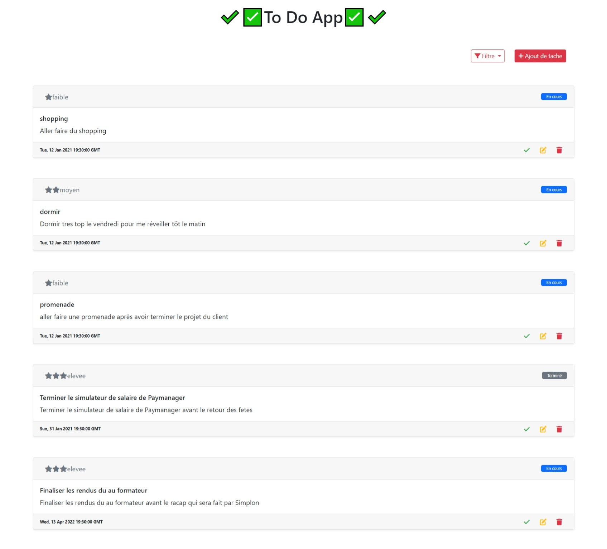

<h1 align="center">
ToDo List With Rest API
</h1>

<h1 align="center">
  

</h1>
<h1 align="center">
  

</h1>

***


### Build with : [Firebase](https://firebase.google.com/)
[Firebase](https://supabase.com)  helps you build and run successful apps
Backed by Google and loved by app development
teams - from startups to global enterprises
<p align="center">

</p>

### Workflow : [Gitflow](https://danielkummer.github.io/git-flow-cheatsheet/)


Installation
------------
### Clone the project
```Terminal```
```shell
git clone https://github.com/Mouhamet99/ToDoApp.git
```


That's it !!!!💥💥💥
Enjoy it!!!!💥💥💥
